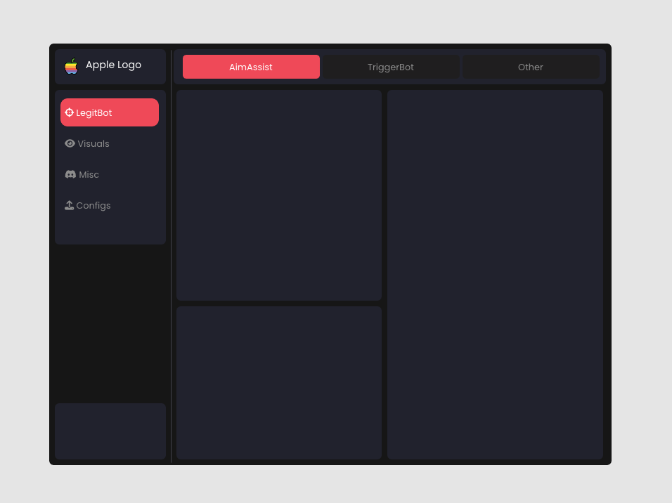
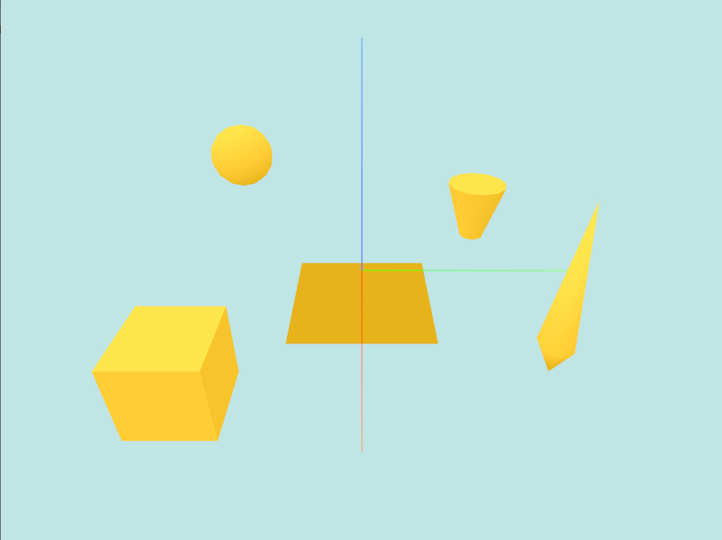
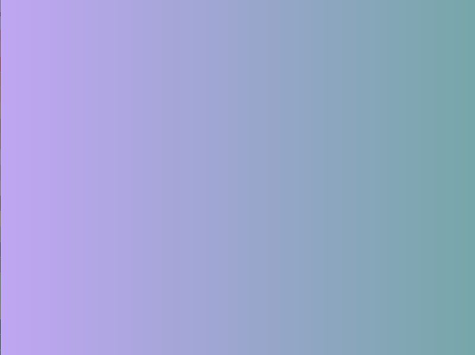
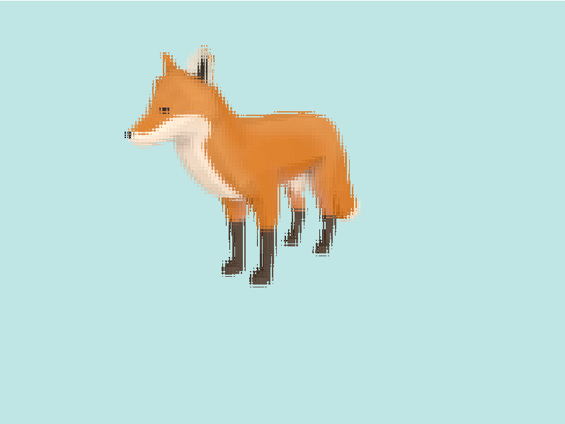
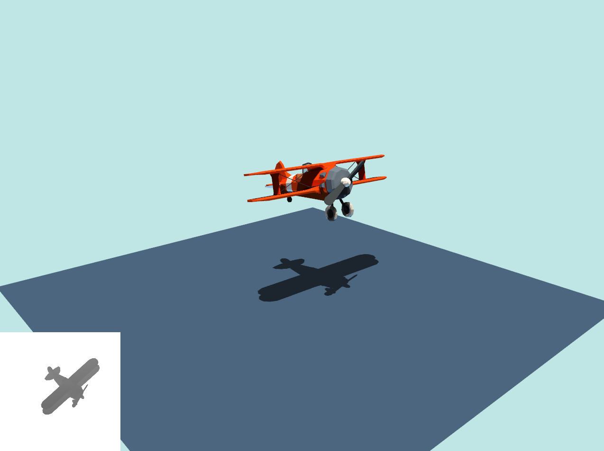
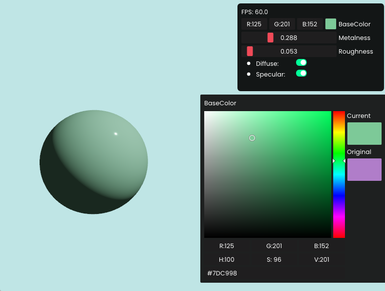
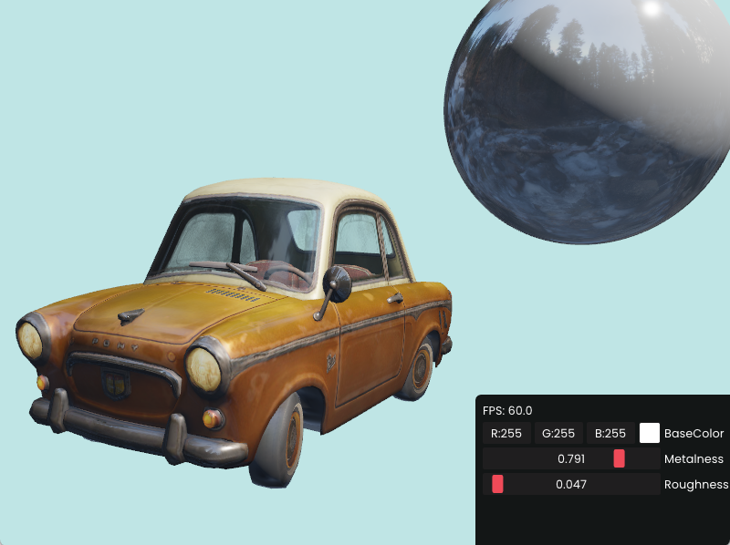
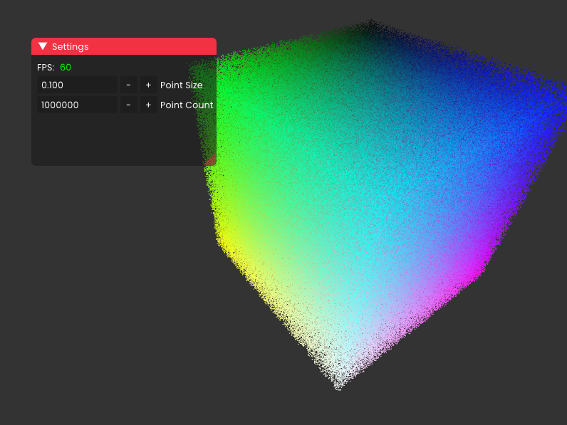

# vivid
Lightweight & easy to use 3D visualization library.

## Examples

#### ImGUI 

#### Primitives

#### Screen gradient

#### Frame buffer

#### Shadow mapping

#### Basic PBR

#### PBR and IBL

#### Point Cloud

## Shader
Supported names of vertex attributes include:

| Attribute | Description                           |
|-----------|---------------------------------------|
| position  | vertex position                       |
| normal    | vertex normal                         |
| tangent   | vertex tangent                        |
| color     | vertex color                          |
| texCoord0 | primary texture coordinate (UV)       |
| texCoord1 | additional texture coordinate         |
| texCoord2 | additional texture coordinate         |
| texCoord3 | additional texture coordinate         |
| texCoord4 | additional texture coordinate         |
| blendWeight | bone blend weights for skinned meshes |
| blendIndices | bone indices for skinned meshes.      |

* When writing a shader, you must use exactly above names to represent the vertex attributes, 
otherwise the shader can't get the location of each attribute automatically. See the `Shader::GetAttributeLocations()` 
function for details.
